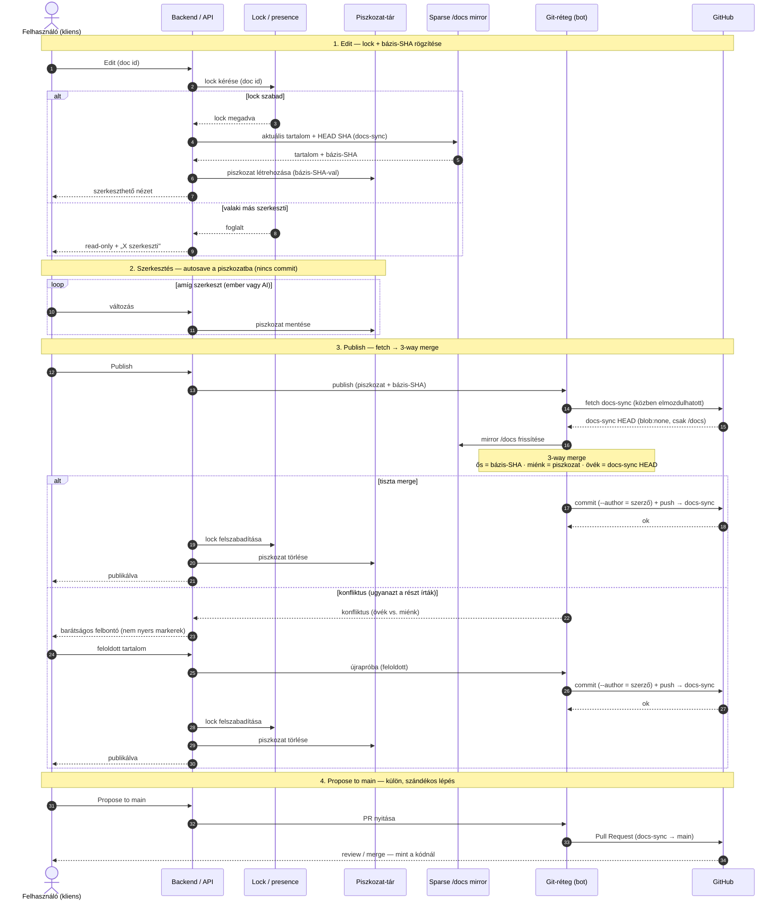
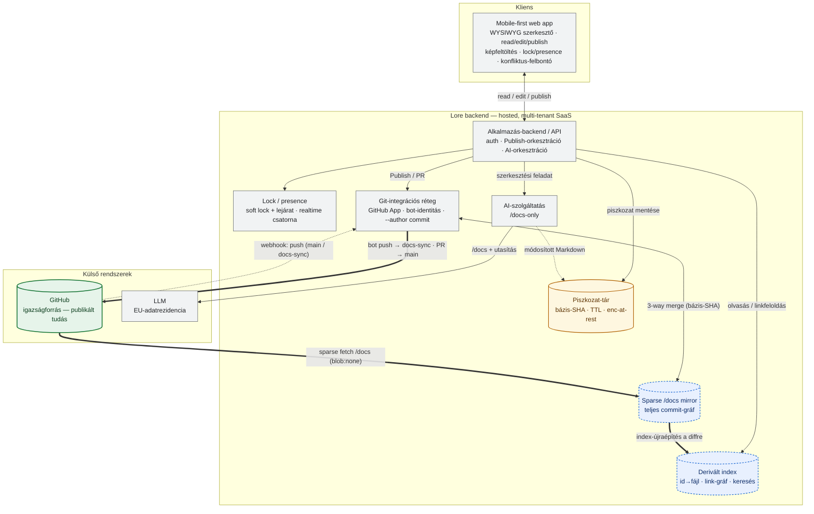

# Lore — Projektkoncepció

*Git-native, AI-first tudásréteg szoftverprojektek számára*

---

## Executive summary

A **Lore** egy Git-native, AI-first tudásréteg szoftverprojektek számára: a projekt dokumentációja verziózott Markdown-fájlokként a forráskód mellett, a Git repositoryban él, így emberek és AI ugyanabból a tudásból dolgoznak. A cél az Apple Notes / Obsidian egyszerűsége egy mobile-first felületen, miközben a tartalom hitelessége és auditálhatósága a Gitből fakad.

**A központi elv:** a Git a *publikált* tudás egyetlen igazságforrása. Amit a Lore szerveroldalon tárol, az vagy a repóból újraépíthető derivált (cache), vagy egy átmeneti szerkesztési állapot úton a Git felé. Ha a Lore megszűnik, a projekt tudása sértetlenül megmarad.

**A meghozott fő döntések:**

- **Szerkesztési modell:** read-first, külön `Edit` és `Publish` — a mentés (gyakori, privát piszkozat) el van választva a commitolástól (ritka, szándékos). A Publish a `docs-sync` branchre commitol; a `main`-re javaslás külön lépés.
- **Konkurencia:** dokumentum-szintű soft lock (egyszerre egy szerkesztő), nem valós idejű együttszerkesztés. Tiszta szerzőség, egyszerű publish. A CRDT post-MVP kitekintés.
- **Szerzőség:** a Lore bot pushol (nincs szükség felhasználói write-jogra), de a szerzőség a Git author-mezőn (`--author`) marad a valódi emberé.
- **Publish-mechanika:** bázis-SHA + 3-way merge; konfliktus esetén barátságos felbontó, sosem nyers Git-markerek.
- **Architektúra:** hosted, multi-tenant SaaS; GitHub App (least-privilege); per-tenant **sparse `/docs` mirror** (derivált, teljes commit-gráffal), webhookkal frissítve.
- **AI (MVP):** csak a `/docs`-on dolgozik (nem küld forráskódot LLM-nek); aszinkron + streaming; az LLM-elhelyezés elv-alapú (provider-absztrakció + EU-rezidencia/zero-retention/no-training + transzparencia).
- **Wiki-link:** a dokumentum-identitás stabil `id`, formátuma slug + rövid random suffix (pl. `payment-api-a3f9`); a linkek ezt az id-t célozzák, a felhasználóbarát cím csak label.
- **Invariáns-robusztusság:** eldöntve az MVP-re: detektálás + graceful degradation + megelőzés a Lore saját írásainál; vezetett javítás post-MVP.
- **Realtime:** SSE a lock/presence-hez, polling-fallbackkel, cserélhető transport mögött.
- **Szerkesztő:** minimál-diff (forrás-megőrző) Markdown-szerializálás + forrás-mód fallback (ProseMirror-alap) — ez védi a „reviewzható, mint a kód" ígéretet.

**MVP-differenciáló:** a Git-native Draft→Publish élmény (mobilos, verziózott, PR-be torkolló doksi-szerkesztés). **Hosszú távú moat:** a kód-tudatos AI (post-MVP).

**Még nyitott post-MVP kérdések:** a brown-field migráció (Confluence/Jira/Slack → repo), valamint a `docs-sync` hosszú távú lifecycle-je (`main`-nel való visszaszinkron, elutasított PR-ek, közvetlen `main`-változások, branch-védelem és kivételes Git-események kezelése).

Az alábbi dokumentum ezt fejti ki részletesen, minden döntésnél a hozzá vezető alternatívákkal és következményekkel — hogy a későbbi iterációk ne nulláról induljanak.

---

## Vízió

A Lore egy Git-native, AI-first tudásréteg szoftverprojektek számára.

Ma a projektek tudása jellemzően több rendszer között oszlik meg: a forráskód GitHubon él, a dokumentáció Confluence-ben, a követelmények Jirában, a döntések Slackben vagy Teamsben — az AI pedig próbálja ezeket összerakni.

A Lore célja ennek a széttagoltságnak a megszüntetése. Minden projektismeret ugyanott éljen, ahol maga a projekt is: a Git repositoryban. A dokumentáció Markdown fájlokként kerül verziózásra a forráskóddal együtt, így emberek és AI ugyanabból a verziózott tudásból dolgoznak.

**Egy mondatban:** a Lore a projekt tudását oda helyezi, ahová való — a forráskód mellé, verziózottan, bárhonnan szerkeszthetően, AI-ra felkészítve.

---

## Alapfilozófia

### A Git a publikált tudás egyetlen igazságforrása

A dokumentum hiteles, verziózott, auditálható állapota a Git repositoryban él. Nincs vendor lock-in, nincs kényszerű exportálás: ha a Lore megszűnik, a projekt tudása sértetlenül megmarad a repóban, más eszközzel is használhatóan.

Fontos pontosítás, amit a koncepció kimond: a Lore **nem** állítja, hogy „semmilyen adat nem él a Giten kívül". Ez sosem lenne tartható — a keresés, a linkfeloldás, az AI-kontextus és a szerkesztés mind igényel szerveroldali állapotot. A helyes megfogalmazás élesebb:

> A Git a projekt **publikált** tudásának egyetlen igazságforrása. Amit a Lore ezen kívül tárol, az vagy a repóból újraépíthető derivált (cache), vagy egy átmeneti szerkesztési állapot úton a Git felé. Kanonikus tartalom soha nem él kizárólag a szerveren.

Ennek részletes döntési keretét (a „három próba": derivált-e vagy forrás; átmeneti-e vagy végleges; mi történik, ha a Lore eltűnik) külön Tárolási filozófia szekció rögzíti.

### A dokumentáció a projekt része

Minden dokumentum a repositoryban található, jellemzően a `/docs` könyvtárban. A könyvtárstruktúra szabadon alakítható:

```
docs/
    product/
    architecture/
    backend/
    frontend/
    api/
    ux/
    operations/
```

A Lore ezt automatikusan felismeri, és ugyanebben a struktúrában jeleníti meg.

### AI-kontextus: MVP és post-MVP

Az MVP-ben az AI **kizárólag a `/docs` tartalmon** dolgozik. Nem kap forráskódot, nem látja a teljes repót, és nem általános projekt-chatbot: konkrét dokumentumszerkesztési feladatokat végez a piszkozaton.

A hosszú távú vízió ettől külön szint. Mivel a dokumentáció és a kód ugyanabban a repositoryban él, post-MVP kiterjesztéssel az AI később a `src/`, `docs/`, `.github/`, `terraform/` és egyéb tartalmakat együtt is értelmezheti. Ez a kód-tudatos AI iránya, de nem az MVP scope része.

---

## Célközönség

A Lore AI-first termékcsapatok számára készül — elsősorban Product Managerek, Business Analystek, UX Designerek, Tech Leadek, fejlesztők és startup alapítók számára, akik közösen építik a projekt tudását.

---

## Felhasználói élmény

A Lore nem GitHub akar lenni. Nem kell repositoryk között navigálni, nem kell teljes könyvtárstruktúrákat böngészni. A cél egy olyan élmény, amely inkább az Apple Notes vagy az Obsidian egyszerűségét idézi: a felhasználó megnyitja a projektet, és azonnal látja a dokumentációt.

### Mobile-first

A mobil nem másodlagos platform. A Lore egyik legfontosabb célja, hogy a dokumentáció mobiltelefonról is kényelmesen szerkeszthető legyen: ötlet gyors lejegyzése, követelmények módosítása, dokumentáció átnézése, képek beszúrása, AI-segített szerkesztés. Hosszabb távon a mobilos AI lesz az egyik legfontosabb funkció.

---

## Szerkesztési modell: Draft → Publish

A Lore szétválasztja a **mentést** (gyakori, privát, olcsó) a **közzétételtől** (ritka, szándékos, megosztott). Ez adja az Apple Notes-szerű egyszerűséget, és egyben megoldja azt, hogy ne keletkezzen ezernyi apró „autosave" commit a repóban.

**Az életciklus:**

1. **Olvasás (alapértelmezett).** Minden dokumentum olvasásra nyílik meg.
2. **Edit.** A szerkesztést külön `Edit` gomb kezdeményezi.
3. **Piszkozat.** A felhasználó folyamatosan szerkeszthet; a web-es alkalmazás automatikusan perzisztálja a változásokat (piszkozat). Ez a szerveren élő, **átmeneti és privát** állapot — úton a Git felé.
4. **Publish.** A `Publish` gomb hatására történik a Git commit + push a `docs-sync` branchre.

### Konkurencia: dokumentum-szintű soft lock

**Döntés:** a Lore egyszerre egy szerkesztőt enged egy dokumentumon (dokumentum-szintű soft lock). Aki elsőként nyom `Edit`-et, azé a dokumentum; a többiek read-only nézetet látnak, „Gábor szerkeszti" jelzéssel.

**Miért ez a helyes választás:**

- **A Lore nem Google Docs.** Nagyon ritka, hogy két ember ugyanazt a dokumentumot ugyanabban a másodpercben szerkeszti; a meeting-jegyzeteket normál esetben nem itt gépelik élőben.
- **A dokumentumoknak gazdájuk van.** A frontmatter `owner` mezője ezt kodifikálja — a dokumentum-modell eleve tulajdonos-központú, nem együtt-gépelés-központú.
- **A valódi kollaboráció a review, nem az együtt-gépelés.** A review pedig eleve aszinkron, és ezt a PR-flow már lefedi.

**Amit ez ad:** nulla CRDT-infrastruktúra, tiszta szerzőség (egy commit = egy szerző), triviális publish, és értelmes `git blame`. A fő megkülönböztető (auditálható, kód-szerűen reviewzható tudás) így sértetlen marad.

**Lock-mechanika:**

- a lock **soft**, nem hard — a szerveren tárolt jelzés, nem Git-szintű zár;
- amíg valakinél a lock, a többiek kizárólag a **publikált** (`docs-sync`-en élő) állapotot olvassák, „X szerkeszti" jelöléssel;
- **lock-lejárat:** inaktivitás után a lock automatikusan felszabadul (arra az esetre, ha valaki nyitva hagyja a szerkesztést és elmegy);
- **átvétel:** lejárt vagy elhagyott lockot egy másik felhasználó átvehet, de nem kap hozzáférést az előző szerkesztő publikálatlan piszkozatához; a korábbi draft a saját felhasználójához kötve marad, vagy a retenciós szabály szerint később törlődik;
- kiegészítésként olcsón beépíthető a **presence** (ki nézi épp a dokumentumot) — ez CRDT nélkül is sokat javít az „együtt vagyunk" érzésen.

**Post-MVP kitekintés:** a lockot **cserélhető policy-ként** tervezzük, hogy a valós idejű együttszerkesztés (CRDT) később *melléépíthető* legyen anélkül, hogy újra kellene húzni az architektúrát — a valós idő nem kapcsoló a meglévő rendszeren, hanem egy második terméksík. Az MVP-re azonban ez tudatosan nem cél.

### Publish mechanika: bázis-SHA + 3-way merge

Mivel egy piszkozat hosszabb ideig is élhet, miközben a `docs-sync` alatta elmozdulhat, a Publish nem lehet naiv felülírás. Ezért:

- a piszkozat mellé eltároljuk a **bázis commit SHA-t** (az a verzió, amiről a szerkesztés indult);
- Publish-kor `fetch` + **3-way merge** a bázishoz képest;
- ha tiszta → commit + push a `docs-sync`-re;
- ha ütközik → **barátságos felbontó** felület („ez a dokumentum megváltozott, amíg szerkesztetted: az övék vs. a tiéd"), nem nyers `<<<<<<<` markerek.

Ez az az egyetlen pont, ahol a Git-konfliktus egyáltalán felszínre kerülhet — a cél, hogy a nem-technikai célközönség soha ne lásson nyers merge-markert.

A teljes folyamat az Edit-től a Publish-ig (és a külön Propose-to-main lépésig), a tiszta és a konfliktusos ággal:



### Publish vs. Propose to main

Érdemes szétválasztani a **Publish**-t (commit a `docs-sync` branchre) a **„Propose to main"**-től (Pull Request nyitása a `main` felé). Így nem minden egyes közzététel keletkeztet PR-t, és elkerülhető a review-zaj.

### Az AI a piszkozaton dolgozik

Az AI-szerkesztés ugyanabban a lock/session-modellben történik, mint az emberi: az AI a **piszkozatot** módosítja, nem egy külön útvonalon a commitolt fájlt — így nem keletkezik újabb konfliktusfelület.

---

## Markdown

A Lore nem saját dokumentumformátumot használ, hanem egy jól definiált Markdown-részhalmazt: CommonMark, GitHub Flavored Markdown táblázatok, checklisták, kódblokkok, képek, linkek, idézetek, frontmatter.

*(Megjegyzés: a strukturált szerkesztő és a wiki-linkek miatt a támogatott részhalmaz pontos definíciója nem opció, hanem kényszer — a szerkesztő ehhez a részhalmazhoz szerializál oda-vissza.)*

---

## Képek kezelése

A képek végső, publikált állapota automatikusan a repositoryba kerül (pl. `/docs/assets/images`). Kép beszúrásakor a Lore először draft-assetként tölti fel a fájlt a szerveroldali objektumtárba, létrehozza a Markdown-hivatkozást, majd a Publish folyamat részeként commitolja és pusholja a Gitbe.

**Döntés — a képeket az MVP-ben sima Git-objektumként kezeljük, Git LFS nélkül.** A várható kép-volumen alacsony: repónként jellemzően néhánytucat, nem túl nagy méretű kép. Ezen a nagyságrenden a repo-hízás nem valós probléma, és a Git LFS bevezetése (külön rendszer, extra költség, és a „csak a Git" tisztaság megtörése) nem indokolt.

**Következmény, amit ez rögzít:** ha egy repó mégis nagy vagy sok binárist halmoz fel (a Git minden verziót örökre megtart), a hízás visszatérhet. Az LFS kérdését ezért tudatosan **elhalasztjuk**, nem elvetjük — akkor nyitjuk újra, ha a valós használat a feltételezett nagyságrend fölé megy.

### Draft-képek életciklusa

**Javasolt MVP-döntés:** a publikálatlan képek a piszkozat részei, ezért ugyanazt az átmeneti és privát életciklust követik, mint maga a draft. Más felhasználó nem látja őket, amíg a dokumentum nincs publikálva.

**Állapotok:**

- **Feltöltött draft-asset:** a kép objektumtárban él, draft-idhez és userhez kötve; a Markdown ideiglenes, Lore által feloldott hivatkozást tartalmaz.
- **Publish alatt:** a Git-réteg a draft-assetet stabil repo-útvonalra másolja (pl. `/docs/assets/images/<doc-id>/<filename-or-hash>.png`), a Markdown-hivatkozást erre írja át, majd a képet és a dokumentumot egy commitban publikálja.
- **Sikeres Publish után:** az objektumtárban lévő draft-példány törölhető, mert a Git lett a forrás.
- **Elvetett vagy lejárt draftnál:** a hozzá tartozó draft-assetek is törlődnek ugyanazzal a retenciós szabállyal.
- **Sikertelen Publish esetén:** a draft-asset megmarad, mert a felhasználó újrapróbálhatja a publikálást; csak akkor törlődik, ha a draftot elvetik vagy lejár.

**Következmény:** a publikálatlan kép nem kerül a Gitbe, így nem marad örökre a repo történetében egy olyan asset, amit a felhasználó végül elvetett. A repo csak a valóban publikált képeket őrzi meg.

---

## Dokumentum-metaadatok

Minden dokumentum saját, a fájlban élő frontmatter-metaadatokat tartalmaz — nincs külön adatbázis:

```yaml
---
# ⚠ Lore által kezelt metaadat. Az `id` mezőt NE módosítsd és NE töröld:
#   erre hivatkoznak a [[wiki-linkek]], átírása minden bejövő hivatkozást eltör.
#   Átnevezés/áthelyezés biztonságos — az identitást az `id`, nem az útvonal adja.
#   Metaadatot lehetőleg a Lore felületén szerkeszd.
id: payment-api-a3f9
title: Payment API
owner: gabor
status: draft
tags:
  - payment
  - backend
---
```

A frontmatter tetejére a Lore egy **figyelmeztető YAML-kommentet** ír, ami az IDE-ből vagy közvetlenül a fájlt szerkesztő embert tájékoztatja a metaadat-módosítás következményeiről (elsősorban arról, hogy az `id` átírása eltöri a bejövő wiki-linkeket).

**Fontos korlát — mit ad ez és mit nem:** ez **emberi (dokumentációs) védővonal, nem technikai garancia.** Aki nem olvassa el, vagy programból írja a fájlt, átgázol rajta. A YAML-komment (`#`) ráadásul nem része az adatnak, így egy újraszerializálás elvben eldobhatja — a Lore-nak ezért a frontmatter-újraírásakor gondoskodnia kell a komment megőrzéséről. A technikai robusztusság MVP-döntése külön rögzített: detektálás + graceful degradation + megelőzés a Lore saját írásainál; a vezetett automatikus javítás post-MVP.

---

## Dokumentumok közötti hivatkozások

A dokumentumok wiki-szerű hivatkozásokkal kapcsolódnak egymáshoz:

```
[[payment-api-a3f9|Payment API]]
```

A Lore ezt **nem fájlnév és nem cím alapján**, hanem a frontmatter `id` mezője alapján oldja fel. Az `id` formátuma slug + rövid random suffix (pl. `payment-api-a3f9`), hogy emberileg felismerhető maradjon, de branch-merge és copy-paste esetén is ütközés-ellenállóbb legyen. A `| Payment API` rész csak felhasználóbarát label: átírható anélkül, hogy a link célja változna.

**Átnevezés / áthelyezés:** ha `docs/backend/payment-api.md` átkerül ide: `docs/payment/api.md`, vagy a címe `Payments API v2` lesz, a hivatkozások nem törnek el, mert a dokumentum identitását nem az útvonala vagy címe, hanem az `id` határozza meg.

**Szerkesztő-UX:** a felhasználó a címet látja és cím alapján keres, de a Markdownba stabil id kerül. Ez a Git-native modellhez illik: a nyers Markdown önmagában is hordozza a link célját, a Lore indexe pedig ebből építi a link-gráfot.

---

## Git integráció

Repository bekötésekor a Lore automatikusan létrehoz egy `docs-sync` munkabranchet a `main` mellett.

```
Publish
  ↓
Commit
  ↓
Push → docs-sync
```

A felhasználó ezután egyetlen gombbal Pull Requestet nyithat a `main` felé — így a dokumentáció ugyanúgy reviewzható, mint maga a forráskód.

**A Publish és a Propose-to-main szét van választva.** A Publish csak a `docs-sync`-re commitol — **nem** nyit automatikusan PR-t. A `main`-re javaslás (Propose to main = PR nyitása) külön, ritkább, szándékos lépés. Így nem keletkezik PR-zaj: több publish gyűlhet össze egy PR-be. Ennek egyenes következménye, hogy a `docs-sync` jellemzően **tartósan előrébb jár** a `main`-nél — ez nem hiba, hanem a normális működés.

### Read-forrás: mit lát az olvasó

**Döntés:** a Lore olvasónézete mindig a **`docs-sync`-ből** olvas (dokumentumonkénti állapottal), nem a `main`-ből.

**Miért nem a `main`:** ha a `main`-ből olvasnánk, a felhasználó a saját, épp most publikált változását nem látná (az csak PR-merge után kerül a `main`-be) — ez eltörné az MVP legfontosabb hurkát (Edit → Publish → látom). Ezt elfogadhatatlan UX-nek ítéljük.

**A reviewzatlanság nem rejtőzik el — háromállapotú badge.** Mivel a `docs-sync` reviewzatlan tartalmat is mutat, minden doksi állapotát jelöljük (a `main`-hez viszonyítva):

- **Szinkronban a `main`-nel** (nincs függő változás) — nincs badge; ez a „minden jóváhagyva" nyugalmi állapot.
- **Publikálva, `main`-re még nem javasolt** (a `docs-sync` előrébb jár, nincs nyitott PR) — halk, informatív badge: „friss verzió, még nem a jóváhagyott ágon". Mivel a szétválasztott modellben ez a *gyakori* köztes állapot, a badge visszafogott, nem riasztó — nincs „mindig sárga a képernyő" hatás.
- **Javasolva `main`-re** (PR nyitva) — badge: „javasolt változat, review alatt".

**Következmények, amiket ez rögzít:**

- **A badge a tárolási filozófiát fordítja le a felhasználónak.** A `main` a kanonikus, reviewzott igazság; a `docs-sync` a friss, átmeneti állapot. A badge nem új fogalom, csak láthatóvá teszi a Git-szinten már kimondott megkülönböztetést.
- **A `docs-sync` „javaslat", nem „majdnem-main".** Ha egy PR-t review közben módosítanak vagy elutasítanak, a `docs-sync`-en élő tartalom eltérhet a végül `main`-be kerülőtől. A badge szövege ezért *javasolt* változatot közvetít, nem semleges „review alatt"-ot.
- **Tudatos kompromisszum:** az olvasók alapból a reviewzatlan `docs-sync`-tartalmat látják. A friss-tartalom UX-ét fontosabbnak ítéljük, mint azt, hogy a Lore-felületen csak jóváhagyott tartalom legyen valaha látható. Aki szigorúan csak a `main`-t akarja fogyasztani (pl. külső olvasó, GitHub Pages), az továbbra is megteheti közvetlenül a repóból — a Lore-felület döntése nem korlátozza a Git-szintű igazságot.

*(Nyitva hagyott, iterálható részlet: a badge-ek pontos szövege és vizuális súlya; hogy a „review alatt" állapot mutasson-e linket a nyitott PR-re.)*

### `docs-sync` lifecycle — post-MVP nyitott kérdés

Az MVP-ben a `docs-sync` munkabranch egyszerűen a Lore által publikált, friss dokumentációs állapotot hordozza, és ebből nyílik PR a `main` felé. A hosszabb távú lifecycle tudatosan post-MVP kérdés.

**Amire később vissza kell térni:**

- mi történik, ha a `docs-sync` → `main` PR-t elutasítják vagy részben módosítva merge-elik;
- hogyan szinkronizálódik vissza a `main` elfogadott állapota a `docs-sync`-re;
- hogyan kezeljük a közvetlen `main`-re érkező dokumentációs változásokat;
- milyen policy legyen force push, branch deletion, branch protection vagy konfliktusos rebase esetén;
- mikor és hogyan lehet a `docs-sync`-et „újraalapozni" anélkül, hogy a felhasználó friss publikálásai elvesznének.

**MVP-szabály:** ezekre nem építünk bonyolult workflow-motort az első verzióban. A rendszer detektálja az eltérést, nem veszít adatot, és a GitHub marad a végső forrás; a kifinomult lifecycle-policy későbbi döntés.

---

## Jogosultság és szerzőség

**Döntés:** a felhasználóknak **nincs** szükségük GitHub write-jogra a repóhoz. A Lore szerkesztési és publikálási műveleteihez explicit jogosultság kell: privát/internal repónál a GitHub szerinti repo read permission elég, publikus repónál viszont a puszta internetes olvashatóság **nem** ad szerkesztési jogot. A pusht mindig a **Lore bot** végzi. Ez így is a helyes: a repo integritása egy kézben marad, és a nem-technikai célközönség (PM, BA, UX) nem függ a repo-write jogosultságoktól.

A szerzőség viszont mindvégig a **valódi emberé** marad, két, egymást erősítő mechanizmussal:

- **Frontmatter `owner`:** ki *felel* a dokumentumért (a dokumentum gazdája).
- **Git author-mező:** ki *írta* az adott változást. A Lore a commitot a szerző nevére állított author-mezővel hozza létre (`git commit --author="Gábor <gabor@…>"`), miközben a *committer* a bot. Így a `git blame` és a GitHub UI is a valódi szerzőt mutatja soronként, a pushhoz szükséges write-jog viszont a boté marad.

A kettő fogalmilag különbözik és megmarad egymás mellett: az `owner` a doksi felelőse, az author-mező egy adott sor/változás írója.

**Következmények, amiket ez rögzít:**

- A korábban meghozott „egy commit = egy szerző, tiszta `git blame`" elv **áll** — de csak azért, mert az author-mezőt a szerzőre állítjuk. (Fontos: a `Co-authored-by:` trailer önmagában *nem* elég — az csak a commit-üzenetben jelenik meg, a `git blame` soronkénti kimenetében nem.)
- A Lore-nak minden felhasználóhoz **stabil identitást** (név + e-mail) kell rendelnie. Ideálisan a GitHub-fiók e-mailje, mert így a GitHub a commitot a felhasználó profiljához is köti.
- A Git repo **all-or-nothing**: nincs per-fájl jogosultság. Akinek explicit repo-hozzáférése van, az minden dokumentumot lát. Ha érzékeny (pl. stratégiai) doksik érzékenyebb hozzáférést igényelnek, azt repo-szeparációval kell megoldani, nem a Lore-on belül — ez enterprise kontextusban tudatosan kezelendő korlát.

### GitHub OAuth + GitHub App jogosultsági modell

**Javasolt modell az MVP-re:**

1. **GitHub OAuth az ember azonosítására.** A felhasználó OAuth-folyamatban jelentkezik be; ebből lesz stabil `gh_user_id`, login, név és commit-authorhoz használható e-mail.
2. **GitHub App installation a repó bekötésére.** A tenant/admin telepíti a Lore GitHub Appot a kiválasztott repókra. Ez adja a bot-identitást, a webhookokat és a szerveroldali read/write műveletekhez szükséges installation tokent.
3. **Hozzáférési kapu: explicit repo-hozzáférés.** A Lore szerkesztési/publikálási felületre csak akkor enged egy felhasználót, ha a repó be van kötve a Lore GitHub App-pal, és a user nem pusztán publikus olvasó, hanem explicit jogosított szereplő: privát/internal repónál GitHub repo read permissionnel, publikus repónál GitHub collaborator/org membership alapján vagy Lore tenant-meghívással. Write nem kell: a commit/push a GitHub App installation tokennel, botként történik.
4. **Jogosultság-ellenőrzés cache-sel, rövid TTL-lel.** A GitHub API hívásokat lehet cache-elni, de ha valakit kivesznek a GitHub repóból/orgból, a Lore-hozzáférése rövid időn belül megszűnik. Kritikus műveletnél (repo megnyitás, Publish, PR-nyitás) érdemes frissíteni vagy újraellenőrizni.
5. **Publikus repó read-only módja opcionális.** Egy publikus repo Lore-nézete engedhet általános olvasást, ha ez termékdöntés, de az anonim vagy pusztán public-read user nem kap draftot, Editet, Publisht vagy PR-nyitást.
6. **Szerzőség külön a jogosultságtól.** A user explicit hozzáférése azt mondja meg, hogy használhatja-e a Lore-t az adott repóra; a Git author-mező azt mondja meg, ki írta a változást; a tényleges push-jog továbbra is a boté.

**Nyitott implementációs részlet:** a GitHub e-mail nem mindig publikus vagy elérhető. Ha nincs commit-authorhoz használható e-mail, fallbackként a GitHub noreply cím használható (`<id>+<login>@users.noreply.github.com`), hogy a commit továbbra is a GitHub-felhasználóhoz köthető maradjon.

---

## Tárolási filozófia (a három próba)

Minden „tegyük szerverre" döntést három kérdésen engedünk át:

1. **Derivált-e vagy forrás?** Ha a repóból újraépíthető (keresési index, link-gráf, embeddingek), ártalmatlan cache. Ha a repó törlésével elveszne (piszkozat, kommentek), valódi állapot — saját durability- és GDPR-kezeléssel.
2. **Átmeneti-e vagy végleges?** A piszkozat rendeltetése, hogy Publish-kor eltűnjön — ez oké. Kanonikus tartalom soha nem élhet véglegesen csak a szerveren.
3. **Mi történik, ha a Lore eltűnik?** A publikált tudásnak sértetlenül a repóban kell maradnia; legfeljebb a félig kész piszkozatok veszhetnek el.

| Adat | Hol él | Kategória |
|------|--------|-----------|
| Publikált dokumentumok, képek, frontmatter | Git | Forrás |
| Commit-történet, PR-ek, review | Git | Forrás |
| Keresési index, link-gráf, AI-embeddingek | Szerver | Derivált (cache) |
| Publikálatlan piszkozat, draft-képek, élő session | Szerver | Átmeneti |

---

## Adatkezelés és compliance

Abban a pillanatban, hogy publikálatlan — potenciálisan bizalmas — ügyfél-dokumentumok ülnek a szerveren, a Lore **adatfeldolgozóvá** válik. Ez nem „majd később" tétel: az enterprise (különösen az insurance-típusú) ügyfél a beszerzési szakaszban kérdezni fogja. Az elejétől a modell része:

- adatkezelési megállapodás (DPA) és tiszta felelősség-felosztás;
- EU-adatrezidencia a piszkozat- és index-tárolásra;
- retenciós szabály (részletesen lásd alább): adatfajtánként külön élettartam;
- titkosítás nyugalmi állapotban (encryption at rest);
- a derivált adat bármikor törölhető és újraépíthető — ez a GDPR-törlési igényeket is egyszerűsíti;
- a Lore **saját naplózása is minimalizált és tartalom-mentes** — az LLM-nél kikötött zero-retention csak akkor ér valamit, ha a Lore observability/debug rétege nem teremti újra a retenció-kockázatot.

### Retenció — nem egy szám, hanem adatfajtánként külön

> **Státusz:** eldöntve, iterálható. A retenció nem egyetlen globális TTL: a rendszernek több adatfajtája van, eltérő élettartam-logikával.

**A négy adatfajta:**

1. **Aktív piszkozat** — amin valaki épp dolgozik. Nincs retenció: Publish-ig vagy elvetésig fennmarad.
2. **Elhagyott piszkozat** — elkezdett, sose publikált, már nem nyúlnak hozzá. Ez a klasszikus retenciós kérdés (lásd az állapotgépet lentebb).
3. **Derivált cache** (mirror, index, embeddingek) — nincs valódi retenciós kérdése (bármikor eldobható/újraépíthető); GDPR-törléskor viszont proaktívan üríthető.
4. **Naplók / audit-nyom** — itt a GDPR (minimalizálás, gyors törlés) és az EU AI Act (naplózhatóság, rekonstruálhatóság) ellentétes irányba húz. A feloldás: **a tartalom és az evidencia szétválasztása** — a prompt/piszkozat *szövegét* rövid ideig tartjuk, a tartalom-mentes *eseménymetaadatot* (ki, mikor, mit) tovább. Vagyis a naplónál is két szám van, nem egy.

**Az elhagyott piszkozat állapotgépe** (a nyers TTL helyett):

`aktív → szunnyadó (figyelmeztetett) → lejárt → törölt`

Az utolsó mentéstől számítva a piszkozat egy darabig **aktív** (~7 nap), utána **szunnyadó**, ahol a felhasználó figyelmeztetést kap („van egy befejezetlen piszkozatod, X nap múlva törlődik"), és csak ezután **törlődik**. A figyelmeztetés a kulcs — ettől kiszámítható a törlés, nem meglepetés. Teljes törlés **~30 napnál** (védhető, könnyen indokolható compliance-küszöb, és bőven ad időt a visszatérésre).

**Amit a szám nem old meg, és ezért külön kell:**

- **Felhasználói elvetés:** a felhasználó bármikor azonnal törölhet egy piszkozatot. A legjobb elhagyott piszkozat az, amit maga zár le.
- **Függő piszkozatok nézete:** a felhasználó lássa a saját befejezetlen piszkozatait, hogy tudatosan kezelhesse őket.

**Következmény, amit ez rögzít — a 30 nap default, nem törvény.** A retenciós ablak **tenant-szinten konfigurálható**, alapértelmezett értékkel. Az enterprise (insurance) ügyfél a beszerzésnél nem a TTL számát kérdezi, hanem hogy be tudja-e állítani a *saját* retenciós szabályát — ezért a helyes architekturális válasz nem hard-coded 30, hanem konfigurálható retenció ~30 napos alapértékkel, lefelé is mozdíthatóan.

*(Nyitva hagyott, iterálható részletek: a konkrét ablakok hangolása; a tartalom vs. evidencia napló-retenció pontos számai; hogy egy tenant milyen granularitásig szabhatja testre a retenciót.)*

---

## Architektúra

### Üzemeltetési modell

A Lore **hosted, multi-tenant SaaS** — a Lore üzemelteti a szervereket. Ezt a compliance-döntések (adatfeldolgozó szerep, EU-adatrezidencia, DPA) implikálják. A GitHubbal való kapcsolatot egy **GitHub App** adja: ez biztosítja a bot-identitást (a pushhoz), a telepítés-alapú jogosultságot és a webhookokat a külső változások detektálására.

**Least-privilege engedély-kör.** A `/docs`-only működés miatt a GitHub App jogköre szűkre húzható: elég a **Contents** (read/write — az olvasáshoz, a `docs-sync` commitokhoz és pushhoz), a **Pull requests** (a `docs-sync` → `main` PR nyitásához) jog, valamint a **push webhook** (a külső változások detektálásához). Ez az enterprise beszerzésnél is erős érv: a Lore csak annyi jogtípust kér, amennyi feltétlenül szükséges.

Fontos pontosítás a biztonsági és compliance review-hoz: a GitHub App engedélyei **repo-szinten** hatnak, nem könyvtár-szinten — a Contents-jog technikailag a teljes repóra vonatkozik, nem korlátozható pusztán a `/docs`-ra. A least-privilege itt tehát a **jogtípusok** szűkítését jelenti (nincs Administration, Actions, Secrets stb. hozzáférés), nem path-alapú korlátozást. A `/docs`-only megszorítás a Lore *saját* működésének önkorlátozása: a mirror, az index, az AI-kontextus és a Publish csak a `/docs` tartalmat dolgozza fel, de ezt nem a GitHub kényszeríti ki könyvtárszinten.

### Az architektúra gerince

> GitHub (forrás) → webhook → per-tenant sparse `/docs` mirror (derivált, teljes commit-gráffal) → ebből épül az index és ezen fut a Publish 3-way merge → a bot pushol vissza `docs-sync`-re → PR a `main`-re.



*A csomópontok színe a tárolási filozófiát kódolja: zöld = forrás (igazságforrás), kék szaggatott = derivált (újraépíthető cache), sárga = átmeneti. A vastag nyilak a fő adat-útvonalak, a szaggatottak az eseményvezérelt mellékutak.*

### Mirror: szerveroldali `/docs`-tükör

**Döntés:** a Lore szerveroldali repo-tükröt (mirror) tart, **de a munkakönyvtárban kizárólag a `/docs` könyvtárat materializálja**. A szerver csak azt a tartalmat dolgozza fel, amivel ténylegesen dolgozik. Ez gyors olvasást és helyben futó, egyszerű 3-way merge-et ad (a Publish-mechanikához kell a valódi commit-gráf), miközben a `/docs`-only alkalmazási szűkítés kisebb compliance-felületet, kisebb tárat és gyorsabb syncet eredményez. A mirror a filozófia szerint **derivált, bármikor eldobható és újraépíthető** cache.

**Technikai invariáns — sparse a munkakönyvtár, teljes a commit-gráf.** A tükrözést partial clone-nal (`--filter=blob:none`) + sparse-checkouttal valósítjuk meg a `/docs`-ra: a munkakönyvtárba csak a `/docs` tartalma materializálódik, a blobok lazán, igény szerint jönnek — **de a commit-history teljes marad**. Ez azért kritikus, mert a `docs-sync` → `main` PR merge-base-e a *teljes* repo commit-gráfján dől el, nem csak a `/docs`-én; sekély (shallow) history mellett a helyi merge-előnézet pontatlan lenne.

**Következmények, amiket ez rögzít:**

- **A mirror valódi (részleges) Git-repo**, nem API-n átrángatott fájlhalmaz. Így tud helyben commitolni, mergelni és pushot előkészíteni — ezért választjuk a sparse checkoutot a GitHub Contents API-val szemben.
- **Frissítés webhookkal.** A GitHub App push-eseményei (`main` vagy `docs-sync`) frissítik a mirror `/docs`-részét, és a diffre újraépítik a derivált indexet (`id`→fájl tábla, wiki-link-gráf, keresés).
- **GitHub a forrás, a mirror eldobható.** Ha a mirror és a GitHub eltér (pl. elveszett webhook), a GitHub az igazság: a mirror bármikor újraszinkronizálható. Ez egybevág a tárolási filozófiával (a mirror derivált).
- **Multi-tenancy és izoláció.** Sok repó mirrorja ül egy rendszerben, tenantonként izoláltan. A `/docs`-only méret miatt ez tár- és biztonsági szempontból kezelhető.
- **A `/docs`-on kívüli blobokra a mirror „vak".** Ez szándékos: a kódváltozások tartalma nem kerül feldolgozásra, nem indexelődik és nem megy LLM-hez. A teljes commit-gráf ettől még megmarad, mert a PR merge-base számításához szükséges.

### Fő komponensek

- **Kliens** (mobile-first web app): WYSIWYG Markdown-szerkesztő, read/edit/publish UI, képfeltöltés, konfliktus-felbontó, lock/presence kijelzés.
- **Alkalmazás-backend (API):** auth, session/lock-kezelés, piszkozat-perzisztencia, Publish-orkesztráció (fetch → 3-way merge → commit → push), PR-nyitás, AI-orkesztráció.
- **Git-integrációs réteg:** GitHub App, bot-identitás, `docs-sync` branch-kezelés, `--author`-os commit, push, webhook-fogadás.
- **Mirror-tár:** per-tenant sparse `/docs` mirror (derivált).
- **Piszkozat-tár:** átmeneti szerveroldali állapot — bázis-SHA, multi-device sync, retenciós TTL, encryption at rest.
- **Derivált index:** `id`→fájl tábla, wiki-link-gráf, frontmatter, keresés (a mirrorból újraépíthető).
- **AI-szolgáltatás:** doksi/piszkozat + utasítás → módosított Markdown, `/docs`-ra szűkítve.
- **Lock/presence-szolgáltatás:** soft lock lejárattal + realtime presence-csatorna.

---

## Realtime transport (lock / presence)

> **Státusz:** eldöntve az MVP-re, de tudottan iterálható (elsősorban a hosting-realitás függvénye). A döntéshez vezető alternatívák alább maradnak.

### Mit kell valójában szállítani

A lock-döntés (dokumentum-szintű lock, egyszerre egy szerkesztő) miatt a Lore-nak **nincs** valós idejű *együttszerkesztése*. A transportnak ezért nem kell karakterenkénti műveleteket, sub-100ms késleltetéssel, konvergencia-garanciával vinnie (az a CRDT-világ lenne). Amit szállítani kell, sokkal szerényebb: **presence és lock-állapot** — ki nézi a doksit, „X szerkeszti", a lock felszabadult/lejárt, és opcionálisan egy „a doksi megváltozott a szerveren" értesítés. Ez ritka, kis méretű, késleltetés-toleráns, döntően **egyirányú (szerver → kliens)** eseményforgalom. A kliens ritka akciói (lock kérése, save, Publish) a meglévő REST/HTTP API-n mennek.

### A mérlegelt alternatívák

- **A — Polling.** A kliens időnként lekérdezi a lock/presence-állapotot. Triviálisan egyszerű, szerver-oldalon állapotmentes, bármilyen infrastruktúrán átmegy. Ára: késleltetett („akadozó" presence), és a sok tétlen kliens fölöslegesen terhel — mobilon **akkumulátort és adatot** eszik, ami a mobile-first célnál valódi hátrány.
- **B — WebSocket.** Kétirányú, állandó kapcsolat, azonnali push. Sima presence-élmény. Ára: állapottartó kapcsolatok (skálázás, reconnect), és mobilon rosszul viseli a hálózatváltást és a háttér/alvó állapotot — robusztus reconnect + heartbeat kell, különben „szellem-presence" marad a szerveren. Kétirányúságra viszont itt nincs is szükség.
- **C — SSE (Server-Sent Events).** Egyirányú szerver → kliens push sima HTTP-n. Pont a fenti forgalmi profil: a szerver pushol lock/presence-eseményt, a kliens akciói HTTP POST-on mennek. Egyszerűbb, mint a WebSocket, jól átmegy proxykon/CDN-en, natív reconnect (`Last-Event-ID`). A régi böngésző-kapcsolatlimit HTTP/2 fölött már nem releváns.

### A döntés (MVP)

- **Transport: C — SSE**, mert az igény egyirányú, ritka, késleltetés-toleráns push — ez az SSE profilja, a WebSocket állapot- és mobil-reconnect komplexitása nélkül, a polling pazarlása nélkül.
- **Fallback: A — polling**, ha a végső hosting nem barátkozik jól a tartós kapcsolatokkal. A presence nem annyira kritikus, hogy nehéz realtime-infrastruktúrát érne meg.
- **Rangsor:** SSE, ha a platform engedi → polling, ha nem → WebSocket csak akkor, ha később mégis valós idejű együttszerkesztés (CRDT) felé mennénk (az post-MVP).

### Következmények, amiket ez rögzít

- **Hosting-feltétel.** A döntés attól függ, hogy a hosting/edge platform kényelmesen tartja-e a hosszú életű SSE-kapcsolatokat. A serverless/edge platformoknál a tartós kapcsolatoknak (SSE és WebSocket egyaránt) időkorlátja és költségvonzata van — ha ez szűk, a fallback a polling.
- **Transport-absztrakció.** A transport egy cserélhető „presence/lock-csatorna" interfész mögött él, hogy SSE ↔ polling ↔ WebSocket cserélhető legyen a szerkesztő és a lock-logika átírása nélkül. Ugyanaz a mintázat, mint a lock-policynál — így egy jövőbeli hosting- vagy CRDT-igény nem dönti össze a réteget.

*(Nyitva hagyott, iterálható részlet: a konkrét polling-intervallum és a lock-lejárati idő hangolása; a hosting-feltétel megerősítése a tényleges platform kapcsolat-időkorlátaival.)*

---

## Szerkesztő: WYSIWYG ↔ Markdown szerializáció

> **Státusz:** eldöntve az MVP-re, de tudottan iterálható. A döntéshez vezető alternatívák alább maradnak, hogy egy jövőbeli felülvizsgálat ne nulláról induljon.

### A magfeszültség (miért load-bearing)

A WYSIWYG-szerkesztőnek belső dokumentum-modellje (fája) van, a tárolási formátum viszont Markdown. A szerkesztő tehát folyamatosan **fa → Markdown** (szerializálás) és **Markdown → fa** (parse) round-tripet végez — ez pedig veszteséges lehet, és épp a fő termékígéretet fenyegeti.

Ennek oka, hogy a **Markdown nem kanonikus**: ugyanaz a megjelenítés többféleképp is leírható (`*` vs `_`, `-` vs `*` felsorolás, ATX vs setext címsor, behúzás, sortörés). Ha a szerkesztő parse-ol → szerkeszt → naívan újraszerializál, „normalizálja" az egész fájlt — így egy háromszavas javításból az egész doksit átíró diff lesz. Ez közvetlenül aláásná a korábbi **„reviewzható, mint a kód" (PR-alapú)** döntésünket: a `git diff` zajjá válna, a review ellehetetlenülne. A szerializáció minősége tehát nem szerkesztő-belügy, hanem a review-ígéret feltétele.

Mivel a Lore **nem birtokolja a repót** (IDE-ből bárki írhat), egy doksi tartalmazhat a szerkesztő sémáján kívüli Markdownt (nyers HTML-blokk, lábjegyzet, egzotikus kiterjesztés). A naiv round-trip ezt elnyelné vagy elrontaná — ez adatvesztés, amit kezelni kell.

### A mérlegelt alternatívák

- **A — Teljes parse → fa → kanonikus újraszerializálás.** A legegyszerűbb szerkesztő-modell. Ára: mindent újraformáz → diff-zaj → a review-ígéret elbukik, hacsak nem kanonizáljuk az egész repót *és* a Lore az egyetlen író — amit expliciten elvetettünk (IDE-írás megengedett). Ezért önmagában nem járható.
- **B — Minimál-diff (forrás-megőrző) szerializálás.** A szerkesztő megőrzi az eredeti forrást, és csak a *ténylegesen módosított* csomópontokat írja újra; az érintetlen részek betű szerint maradnak. Tisztán tartja a diffet. Ára: nehezebb megépíteni (forrás↔fa pozíció-leképezés, source-mapping).
- **C — Hibrid: WYSIWYG + nyers forrás-mód mint menekülőút.** Gyakori tartalomra WYSIWYG; a sémán kívüli vagy fidelitás-kritikus tartalomnál a szerkesztő **forrás-módra** vált (nyers Markdown). Így az ismeretlen Markdown nem sérül.

### A döntés (MVP)

- **Szerializációs stratégia: B — minimál-diff (forrás-megőrző).** Ez védi a review-ígéretet a normál úton.
- **Ismeretlen-Markdown-kezelés: passthrough-megőrzés + C forrás-mód fallback.** Az ismeretlen konstrukciókat a fa **átlátszó (passthrough) blokként** őrzi meg — még ha nem is tud rájuk WYSIWYG-műveletet, változatlanul visszaírja őket; szükség esetén a felhasználó forrás-módban nyersen szerkeszti. Adat sosem veszik el.
- **Framework-család: ProseMirror-alap** (séma-vezérelt, jól kezeli az egyedi csomópontokat, mint a `[[wiki-link]]`). Mivel a termék **mobile-first**, az érintőképernyős/IME-bevitel első osztályú kiválasztási szempont, amit korán, valódi eszközön kell validálni — itt térnek el legjobban a frameworkök és itt lakik a legtöbb bug.

### Következmények, amiket ez rögzít

- A **„reviewzható, mint a kód" ígéret** csak a minimál-diff szerializálással áll — a naiv (A) round-trip megtörné. A kettő össze van kötve.
- A szerkesztő sémája **maga a „jól definiált Markdown-részhalmaz"** — a részhalmaz nem külön spec, hanem az, amit a séma ismer.
- Három korábbi döntés itt landol: a **frontmatter figyelmeztető kommentjének** túl kell élnie az újraszerializálást (komment-megőrző kezelés); a **`[[wiki-link]]`** egyedi séma-csomópont, amelynek címkéjét az indexből kell feloldani; a **képbeszúrás** image-node, ami a repo asset-útvonalára képez.
- A passthrough-blokk **nem opcionális**: a nem-birtokolt repó miatt a szerkesztőnek mindig vissza kell tudnia írni azt, amit nem ért.

*(Nyitva hagyott, iterálható részletek: a konkrét framework a ProseMirror-családon belül — pl. TipTap vs. saját séma; a source-mapping megvalósításának mélysége; a forrás-mód és a WYSIWYG közti váltás UX-e mobilon.)*

---

## AI: futási mód és LLM-elhelyezés

> **Státusz:** eldöntve az MVP-re, de tudottan iterálható — az LLM-elhelyezés a beszerzési/compliance-realitás és a modell-piac függvénye. Két külön kérdés lakik itt: a **futási mód** (UX/architektúra) és az **LLM-elhelyezés** (compliance).

### 1. Futási mód — döntés: aszinkron, streameléssel

Az MVP AI-ja dokumentum-szintű, egy-lövéses szerkesztési feladat (átírás, összefoglalás, kiegészítés) egy `/docs`-méretű doksin — jellemzően pár másodperctől néhány tíz másodpercig tartó LLM-hívás.

- **Elvetett — szinkron:** egy blokkoló kérés a teljes generálásig. Egyszerű, de mobil-hálózaton egy 20–30 másodperces nyitott kérés törékeny (timeout, hálózatváltás) — épp a mobile-first célnál a legkockázatosabb.
- **Választott — aszinkron, streameléssel:** a Publish gomb helyett az AI-kérés azonnal job-azonosítót ad, az eredmény **a már eldöntött SSE-csatornán** érkezik vissza, tokenről tokenre streamelve.

**Szinergia a realtime-döntéssel:** az aszinkron mód itt nem új infrastruktúra, hanem a presence/lock-hoz választott SSE-transport újrahasznosítása. A stream jobb UX (a felhasználó látja épülni a választ), és illik a piszkozat-modellhez: az AI a **piszkozatba** ír, a felhasználó látja, majd ő nyom Publish-t.

### 2. LLM-elhelyezés — döntés: elv-alapú (provider-független)

A `/docs`-only scope már sokat segít (nem küldünk *forráskódot* LLM-nek), de a dokumentáció maga is tartalmazhat személyes adatot vagy üzleti titkot (architektúra, ügyfélnevek, incidensek). Amint ez LLM-hez kerül, adatfeldolgozási lánc keletkezik, amit az EU-ügyfél (főleg insurance) a beszerzésnél átvilágít. Konkrét szolgáltatót ezért **nem** rögzítünk (az árazás/feltételek gyorsan változnak, és beszerzéskor élőben ellenőrizendők) — helyette egy elvet, ami túléli a szolgáltatóváltást.

**A rögzített elv három pillére:**

1. **Provider-absztrakció.** Az LLM-hívás egy provider-független interfész mögött él, hogy a modell/szolgáltató kód-átírás nélkül cserélhető legyen — ugyanaz a mintázat, mint a locknál és a transportnál.
2. **Szerződéses minimum.** EU-adatrezidencia + zero-retention + no-training, a DPA-ban al-adatfeldolgozóként listázva.
3. **Transzparencia és audit.** A felhasználó jelzést kap az AI-módosításról; a Draft→Publish adja az emberi jóváhagyási pontot és a természetes audit-nyomot (az AI a piszkozatba ír, ember hagyja jóvá és commitolja `--author`-ral).

**A piac (2026-os pillanatkép, tájékozódásul — nem választás):**

- **Hyperscaler EU-régió** (Azure OpenAI, AWS Bedrock, Google Vertex AI): EU-adatrezidencia, no-training default, DPA — a leggyorsabb út, ha a szerződés rendben. Fenntartás: az EU-régiós feldolgozás nem teljes szuverenitás; a CLOUD Act / FISA 702 miatt a US-anyacégű szolgáltatónál marad reziduális transzfer-kockázat.
- **EU-honos szolgáltató** (EU-jog alatt, US-joghatóságon kívül): a legerősebb adatszuverenitás és a legrövidebb sub-processor-lánc, cserébe jellemzően nyílt súlyú modellek (gyengébb csúcsminőség) és több üzemeltetés.
- **EU-s AI-gateway** (proxy több szolgáltató EU-végpontjához): kényelmes absztrakció, de egy extra al-adatfeldolgozót ad a lánchoz.

**Modellspecifikus tény:** a Claude EU-adatrezidenciája nem az elsőfélként kínált API-n, hanem felhős telepítéseken (AWS Bedrock / Google Vertex AI EU-régiók) érhető el — ezt a provider-absztrakció amúgy is elfedi.

### Következmények, amiket ez rögzít

- **A megfelelőség szerződés + konfiguráció + lokáció, nem márkanév.** Az EU-adatrezidencia önmagában nem egyenlő a GDPR-megfeleléssel — a zero-retention, a no-training és a sub-processor-transzparencia legalább annyira számít, mint a földrajz.
- **EU AI Act-időzítés.** A rendelet 2026. augusztus 2-án válik teljesen alkalmazandóvá. A doksi-szerkesztés alacsony kockázatú felhasználás; a fő kötelezettség a **transzparencia** és a **naplózhatóság** — amit a Draft→Publish modell természetesen ad.
- **MVP-indulás:** kereskedelmi API EU-régióval és a fenti szerződéses minimummal a pragmatikus start; a provider-absztrakció miatt EU-honos vagy on-prem modellre később fájdalommentesen át lehet állni, ha egy ügyfél megköveteli. Az MVP-ben az LLM-hez küldött tartalom alkalmazási szinten `/docs`-ra korlátozott: ez erős kitettségcsökkentés, de nem helyettesíti a szerződéses és technikai kontrollokat.
- **Belső elv (a Regolo-mintázat visszaköszön):** az LLM-et **stateless compute-rétegként** kezeljük — bármilyen perzisztencia (piszkozat, audit) a Lore saját, EU-rezidens adatrétegében történik, a saját kontrolljaink alatt, nem az LLM-szolgáltatónál.

*(Nyitva hagyott, iterálható részletek: a konkrét szolgáltató és modell; hyperscaler-EU-régió vs. EU-honos vs. gateway közti választás egy valós ügyfél-követelmény fényében; a streaming-eredmény és a piszkozat-mentés pontos összjátéka.)*

---

## MVP funkcionalitás

- GitHub repository bekötése
- `/docs` könyvtár automatikus felismerése, struktúra megőrzése
- Új Markdown-dokumentum létrehozása a Lore webes felületéről: mappa/célútvonal kiválasztása, cím megadása, automatikus slug/path és frontmatter `id` generálás, majd draftként szerkesztés és Publish-kor új `.md` fájl commitolása a `docs-sync` branchre
- Markdown WYSIWYG szerkesztő
- Mobile-first felület
- Read-first nézet + `Edit` / `Publish` modell
- Dokumentum-szintű lock + presence
- Bázis-SHA + 3-way merge Publish-kor, barátságos konfliktus-felbontóval
- Képfeltöltés
- Wiki-linkek (slug + rövid random suffix alapú stabil id-val)
- Frontmatter támogatás
- Automatikus commit + push a `docs-sync`-re
- Pull Request létrehozása a `main` felé

---

## AI funkciók

### MVP

**Scope-döntés:** az MVP-ben a Lore AI-ja **kizárólag a `/docs` könyvtáron** dolgozik, nem a teljes repón. Az AI nem általános chatbot, hanem konkrét dokumentumszerkesztési feladatokat végez a piszkozaton: dokumentum javítása, rövid összefoglaló, átírás, utasítás alapján történő módosítás.

Példa: *„Egészítsd ki ezt a dokumentumot azzal, hogy a Payment Service exponential backoff retry logikát használ."* — az AI közvetlenül módosítja a Markdown-piszkozatot.

**Miért csak a `/docs`:**

- **Adatkormányzás.** Nem küldjük az ügyfél (jellemzően zárt) *forráskódját* LLM-nek — csak a dokumentációt, amit amúgy is az AI-nak szántak. Ez drámaian csökkenti a GDPR / EU AI Act kitettséget.
- **Unit economics.** A `/docs` nagyságrendekkel kisebb, mint egy teljes repo, így az AI-hívások költsége kezelhető marad.
- **Fókusz.** Az MVP AI-ja szűk, jól körülhatárolt feladatot lát el, nem „érti az egész projektet".

**Következmény, amit ez rögzít:** az MVP-ben az AI **nem kód-tudatos**. Márpedig a kód-tudatos AI-t azonosítottuk az egyetlen valódi megkülönböztetőként az Obsidiannel / GitBookkal szemben. Ebből következik, hogy az **MVP differenciálója nem az AI, hanem a Git-native Draft→Publish élmény** (mobilos, PR-be torkolló, verziózott doksi-szerkesztés). A kód-tudatos AI a *vízió* és a post-MVP moat — lásd lentebb.

### Hosszú távú AI-képességek (post-MVP)

A `/docs`-ról a teljes repóra való kiterjesztés az, ahol a kód-tudatos AI megszületik — és egyben az a pont, ahol az adatkormányzási döntéseket (EU-adatrezidencia, mit-küldünk-LLM-nek, per-repo opt-in) meg kell hozni. Ezek a döntések tudatosan a bővítéskor jönnek, nem az MVP-ben.

Mivel ekkor az AI egyszerre látja a dokumentációt és a forráskódot, olyan képességek nyílnak meg, amelyek hagyományos rendszerekben nem lehetségesek:

- elavult dokumentáció felismerése;
- architektúra és implementáció összevetése;
- hiányzó dokumentáció felismerése;
- dokumentáció-frissítés javaslata kódváltozások után;
- architektúra-diagramok generálása;
- természetes nyelvű kérdés–válasz a teljes projektről;
- projekt szintű tudásgráf építése;
- hosszú távú AI projektmemória.

*(Technikai realitás: egy valódi repo több millió token — a „mindent egyszerre" nem fér a kontextusablakba, ezért retrieval/embedding réteg kell. Ez derivált adat, cache-elhető és újraépíthető.)*

---

## Pozicionálás

A Lore **nem** egy újabb dokumentációs rendszer és nem Confluence-klón. A Lore egy Git-native tudásréteg AI-first termékcsapatok számára.

A mezőny (Obsidian, GitBook, Notion, Confluence) sok mindent tud már: Markdown, wiki-link, frontmatter, Git-szink, mobilapp. Ezért fontos két időhorizonton külön kimondani a megkülönböztetőt:

- **MVP-differenciáló: a Git-native Draft→Publish élmény.** A mobilos, read-first, PR-be torkolló, verziózott doksi-szerkesztés — az, hogy a dokumentáció ugyanúgy reviewzható, mint a kód, közvetlenül a repóban, vendor lock-in nélkül. Ez az, amit az MVP *valóban* nyújt.
- **Hosszú távú moat: a kód-tudatos AI.** Az, hogy a tudás a kód mellett, verziózottan, az AI számára közvetlenül olvashatóan él. Ez a legnehezebb és legdrágább rész — a tartós differenciálás ezen az egy lábon áll, ezért érdemes kiemelkedően jóra csiszolni. De ez post-MVP: az MVP-t **nem** ezzel adjuk el.

---

## Hosszú távú vízió

A Lore végső célja nem egy jobb dokumentumszerkesztő, hanem egy platform, ahol a projekt teljes emlékezete egyetlen, verziózott helyen él. A jövő AI-rendszerei nem különálló dokumentumokat fognak olvasni, hanem a projekt teljes kontextusát: a forráskódot, a döntéseket, a követelményeket, az architektúrát és az üzemeltetési tudást együtt. A Lore ezt az egységes projektmemóriát szeretné megteremteni.

---

## Nyitott kérdések (még eldöntendő)

Ezek a pontok tudatosan nyitottak — a koncepció keretezi őket, de még nem dönti el:

- **Brown-field migráció (post-MVP-re tolva).** A `/docs` auto-felismerés feltételezi, hogy a doksik már strukturált Markdownként ott vannak. De a legtöbb csapatnál épp a Confluence/Jira/Slack szétszórtság a probléma — a migráció az igazi fájdalom. Tudatosan **post-MVP**: az MVP a green-field (már repóban élő doksi) esetre koncentrál; a migráció és „ki az első valódi felhasználó" kérdése később kerül elő.
- **`docs-sync` lifecycle (post-MVP-re tolva).** Az MVP-ben elég, hogy a `docs-sync` a Lore friss publikált állapotát hordozza, és PR nyitható belőle a `main` felé. Később külön policy kell arra, hogyan szinkronizálódik vissza a `main`, mi történik elutasított vagy módosítva merge-elt PR-rel, közvetlen `main`-változással, branch-védelemmel, force push-sal vagy branch-újraalapozással.

### Már eldöntött (korábban nyitott) kérdések

- **Invariáns-robusztusság.** A nem-birtokolt repó elrontott frontmattere/id-je ellen: MVP-ben detektálás + graceful degradation + megelőzés a Lore saját írásainál (a vezetett javítás post-MVP). Id-formátum: slug + random suffix. Duplikátum: a régebbi commit nyer. (Lásd: *Technikai terv → Invariáns-robusztusság*.)

- **Read-forrás (`main` vs. `docs-sync`).** Az olvasónézet a `docs-sync`-ből olvas (a friss, saját-publikálás azonnal látszik), a reviewzatlanságot háromállapotú badge jelzi. A Publish és a Propose-to-main szét van választva; a Publish nem nyit PR-t. (Lásd: *Git integráció → Read-forrás*.)
- **Retenció.** Nem egy szám: adatfajtánként külön (aktív/elhagyott piszkozat, derivált cache, napló). Elhagyott piszkozat: állapotgép ~30 napos, tenant-szinten konfigurálható defaulttal. (Lásd: *Adatkezelés és compliance → Retenció*.)
- **Konkurens szerkesztés.** Dokumentum-szintű soft lock (egyszerre egy szerkesztő), nem valós idejű együttszerkesztés. A CRDT tudatos post-MVP kitekintés. (Lásd: *Szerkesztési modell → Konkurencia*.)
- **Jogosultság és szerzőség.** A Lore szerkesztéshez/publikáláshoz explicit repo-hozzáférést kér: privát/internal repónál repo read permission elég, publikus repónál a puszta public read nem ad szerkesztési jogot. A Lore bot pushol (nincs szükség felhasználói write-jogra); a szerzőség a Git author-mezőn (`--author`) és a frontmatter `owner`-en keresztül marad a valódi emberé. Korlát: a repo all-or-nothing hozzáférésű. (Lásd: *Jogosultság és szerzőség*.)
- **AI-scope és governance.** Az MVP AI-ja csak a `/docs`-on dolgozik — nem küldünk forráskódot LLM-nek, a költség kezelhető. Következmény: az MVP AI-ja nem kód-tudatos, ezért az MVP-differenciáló a Git-native élmény. A teljes repóra bővítés és a hozzá tartozó governance post-MVP döntés. (Lásd: *AI funkciók*.)
- **AI futási mód és LLM-elhelyezés.** Aszinkron + streaming a meglévő SSE-csatornán; az LLM-elhelyezés elv-alapú (provider-absztrakció + EU-rezidencia/zero-retention/no-training szerződéses minimum + transzparencia), konkrét szolgáltató nélkül. (Lásd: *AI: futási mód és LLM-elhelyezés*.)
- **Realtime transport.** SSE a lock/presence-hez, polling-fallbackkel, cserélhető transport-absztrakció mögött. (Lásd: *Realtime transport*.)
- **Szerkesztő-szerializáció.** Minimál-diff (forrás-megőrző) szerializálás + passthrough-megőrzés + forrás-mód fallback, ProseMirror-alapon. (Lásd: *Szerkesztő: WYSIWYG ↔ Markdown szerializáció*.)
- **Képek és Git LFS.** A képeket az MVP sima Git-objektumként kezeli, LFS nélkül — a várható volumen alacsony (repónként néhánytucat kép). Az LFS tudatosan elhalasztva, nem elvetve; akkor nyílik újra, ha a valós volumen a feltételezett nagyságrend fölé megy. (Lásd: *Képek kezelése*.)
- **Draft-képek életciklusa.** A publikálatlan képek draft-assetként, privát átmeneti állapotként élnek az objektumtárban; Publish-kor kerülnek stabil repo-útvonalra és Git commitba; elvetett vagy lejárt drafttal együtt törlődnek. (Lásd: *Képek kezelése → Draft-képek életciklusa*.)
